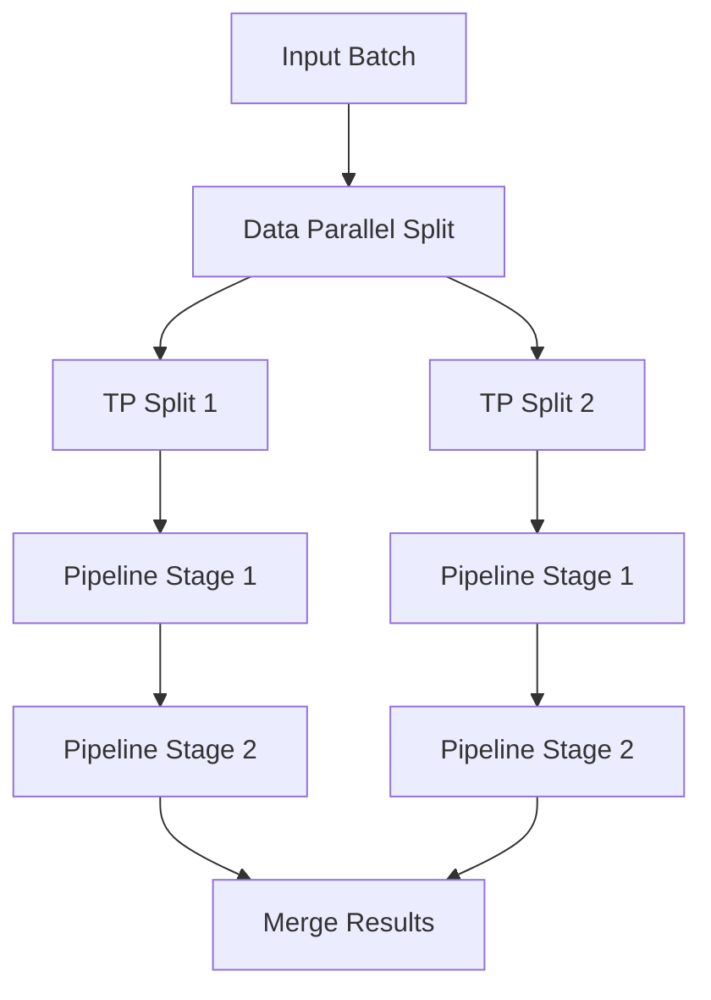

```mermaid
graph TD
    A[Input Batch] --> B[Data Parallel Split]
    B --> C1[TP Split 1]
    B --> C2[TP Split 2]
    C1 --> D1[Pipeline Stage 1]
    C2 --> D2[Pipeline Stage 1]
    D1 --> E1[Pipeline Stage 2]
    D2 --> E2[Pipeline Stage 2]
    E1 --> F[Merge Results]
    E2 --> F

```

```mermaid

graph LR
    A[Input] --> B[Stage 1]
    B --> C[Stage 2]
    C --> D[Stage 3]
    D --> E[Stage 4]
    B -.-> |layer1/output| C
    C -.-> |layer4/output| D
    D -.-> |layer8/output| E

```